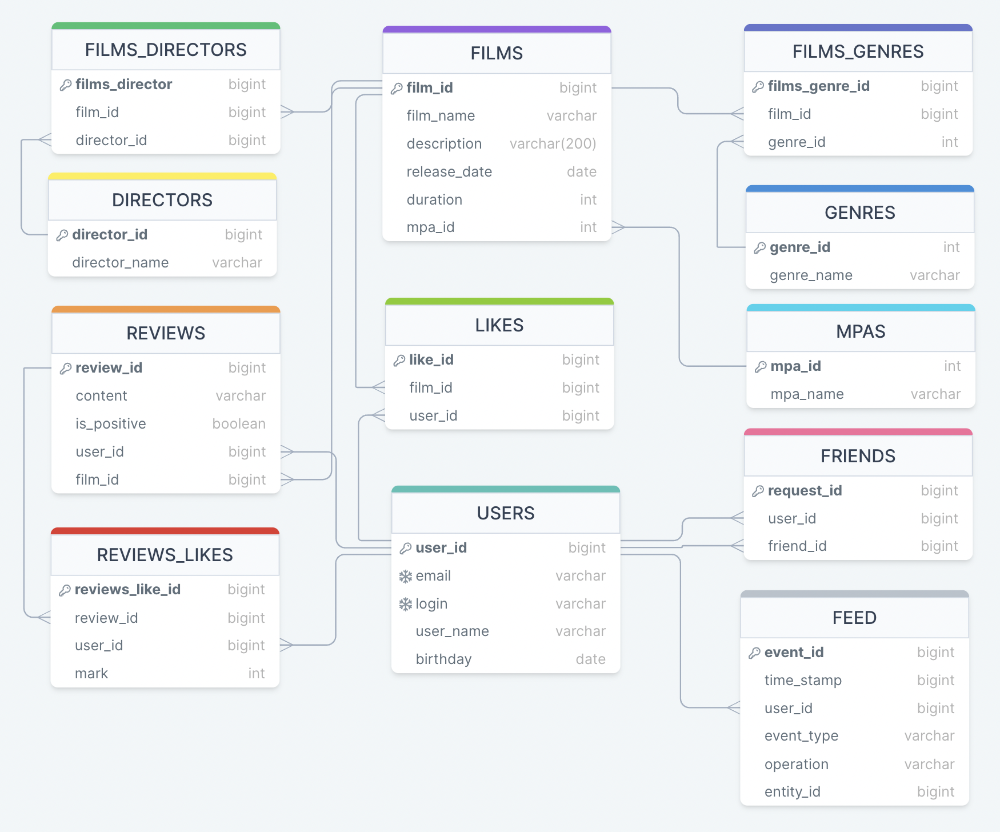

# 12 спринт 6 группа

### Распределение задач

- Удаление фильмов и пользователей (`add-remove-endpoint`)  - [Алексей Курочкин](https://github.com/ku-alexej).
- Функциональность «Общие фильмы» (`add-common-films`) - [Кирилл Бабиченко](https://github.com/KirillBabichenko).
- Функциональность «Рекомендации» (`add-recommendations`) - [Энтони-Эльвек Босхаев](https://github.com/Anthony-Elvek).
- Функциональность  «Отзывы» (`add-reviews`) - [Алексей Курочкин](https://github.com/ku-alexej).
- Добавление режиссёров в фильмы (`add-director`) - [Илья Другов](https://github.com/BegemotKotei).
- Функциональность «Лента событий» (`add-feed`) - - [Кирилл Бабиченко](https://github.com/KirillBabichenko).
- Вывод самых популярных фильмов по жанру и годам (`add-most-populars`) - [Энтони-Эльвек Босхаев](https://github.com/Anthony-Elvek).
- Функциональность «Поиск» (`add-search`) - [Алексей Бердин](https://github.com/JustAlexB).

### ER_model

